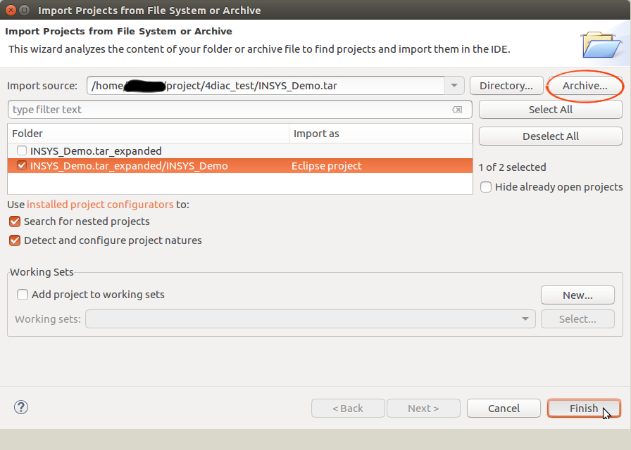
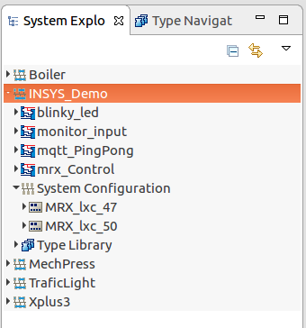
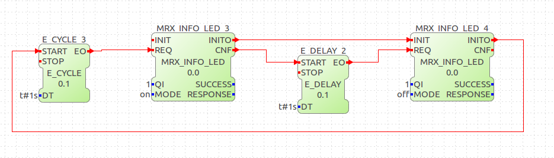
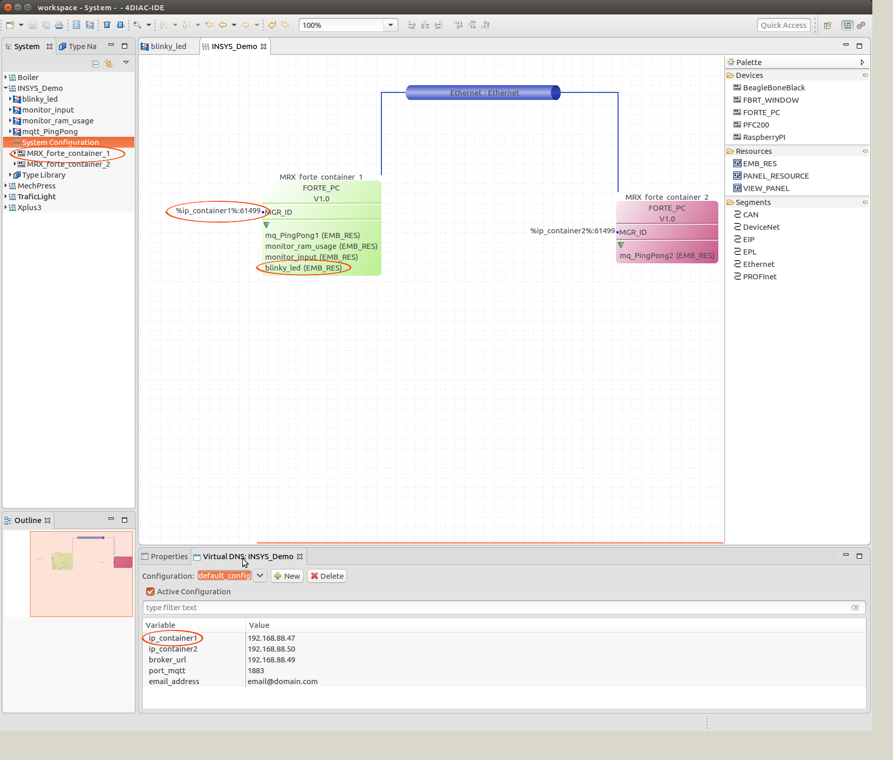
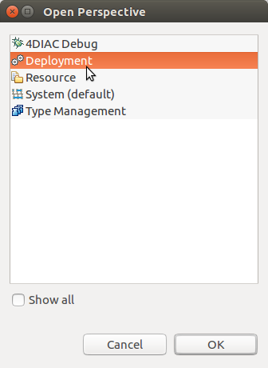
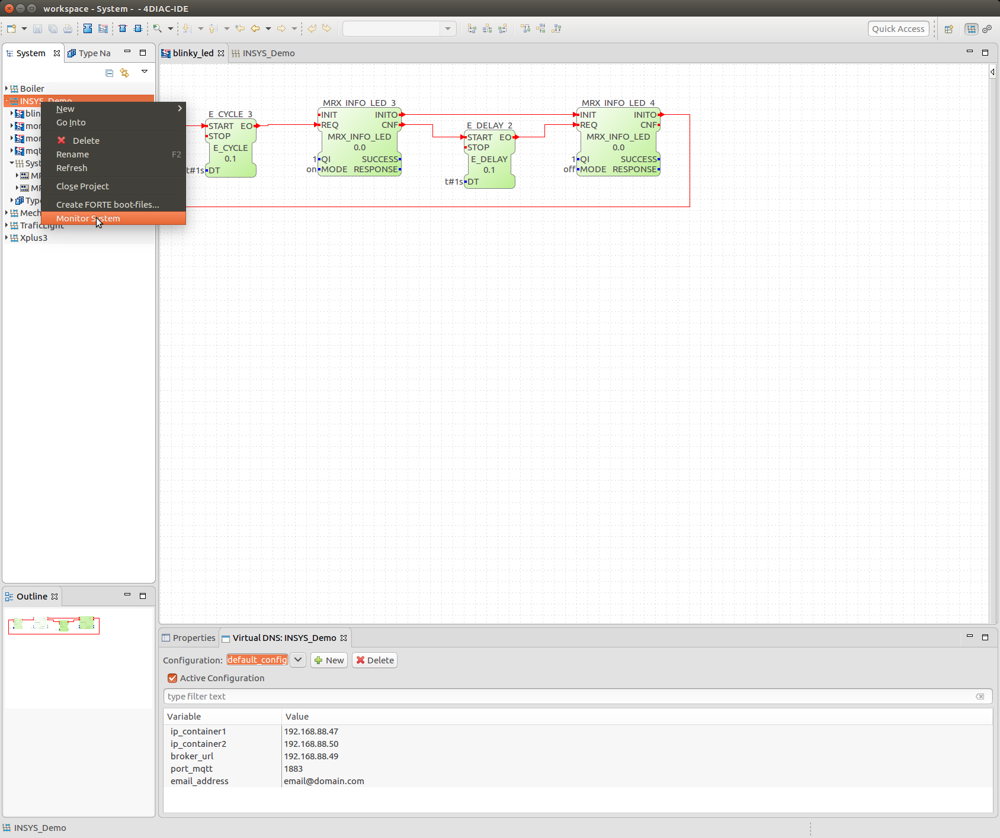
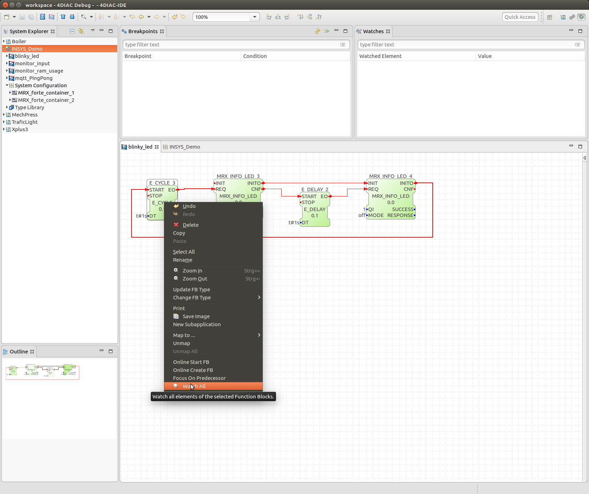

# Container Application "Eclipse 4DIAC"

## Introduction
[4DIAC](https://eclipse.org/4diac/) is an open source Soft-PLC project hosted under the Eclipse foundation, developed and maintained by the [fortiss](https://www.fortiss.org/en/research/projects/4diac/) research institute of TU Munich.
The 4DIAC IDE and the FORTE runtime environment, provide a framework for distributed industrial automation and control by implementing the IEC 61499 standard.
The framework is used to implement distributed/interacting control tasks spread among different target devices turning the target devices into Soft-PLCs participating in the overall control application.

This document describes how to set up the 4DIAC-IDE on your development machine and connect to a container with the forte-RTE on your target router.

## Download and prepare the 4diac-IDE
Download and unpack the latest stable release of the [4diac-IDE](http://www.eclipse.org/4diac/en_dow.php). If you want to install from source, download directly from the [4diac-repositories](http://git.eclipse.org/c/4diac/org.eclipse.4diac.ide.git).

### Check 4diac-IDE execution
Change into the 4diac-folder and <b>run the 4DIAC-IDE</b> executable. Set the workspace to suggested folder and check if the 4diac-IDE starts without errors.

### Download demo projects
In order to access router functionalities like I/Os, sending emails and MQTT messages, reading CPU and RAM usage through the CLI (Command Line Interface), router specific interface function blocks need to be added. Some sample applications are provided to demonstrate how to work with the router specific function blocks.

Download the demo project archive [INSYS_Demo.tar](http://m3-container.net/M3_Container/closed_sources/INSYS_Demo.tar). Within the 4diac-IDE select <b>File -> Open projects</b>: 

 

Select the archive with demo projects and import the eclipse project and click finish.

The INSYS_Demo project should appear within the *System Explorer*: 

 

Before you can start playing with the demo projects and create your own distributed applications, at least one device with the forte runtime environment is necessary.

## Install and configure a container with 4diac-RTE (forte)
In order to execute your modelled control applications across various devices, on every involved device a runtime needs to be present. The 4diac runtime environment (RTE) is called forte and a pre built container for INSYS routers is available.

- Download the [container_forte.tar](http://m3-container.net/M3_Container/images/container_forte.tar) to your local machine and upload the forte container onto your router via its web interface: <b>Administration -> Container -> Import container</b>.
- Bridge the container to an IP net that has access to your PC and give the container an IP address that is not already used in the selected IP net.

The next steps are optional, but recommended. They configure DNS and gateway, so the applications in the container access other nets (like the internet).

- Log in to the container and set up the networking there. Adjust the IP address to the one the container has been given. User name and password are both <b>root</b>.
<pre>
joe@pc ~  $ <b>ssh root@192.168.1.3</b>
</pre>
- Enter a reachable address for the DNS server, most likely this will be the routers IP address:
<pre>
root@container_forte ~  $ <b>echo "nameserver *IP_ADDRESS_OF_NAMESERVER*" > /etc/resolv.conf</b>
</pre>
- Edit the script that will set the default gateway after starting the container:
<pre>
root@container_forte ~  $ <b>vi /bin/start_net</b>
</pre>
- Press <b>"i"</b> to enter the edit mode of vi and exchange the IP address of the default gateway, most likely this will also be the routers IP address. Store and exit vi with the keys <b><\ESC> : x</b>.
- Execute the script, so the default route gets set:
<pre>
root@container_forte ~  $ <b>/bin/start_net</b>
</pre>
- Test the network connection and make sure that TCP traffic is allowed to your container through the IP-filter in case you activated filtering.

## Run demo application *blinky_led*
To verify the correct installation of 4diac and the forte container on your router, we will deploy the *blinky_led* demo application.
The application will toggle your routers Info-LED with the specified interval when running.

</b>

Find the <b>System Explorer</b> tab on the left side of the IDE and double click on <b>System Configuration</b> configure your local resource. You currently might have only one forte container (the green one in the picture below) on your router, which is sufficient if you only want to work with a single device for now. For more sophisticated projects you can instantiate multiple forte containers on your router to simulate a distributed system.

Change the IP address to your containers IP address with a double click on the IP address, e.g. <b>192.168.1.3:61499</b> where <b>192.168.1.3</b> is the IP address and <b>:61499</b> the port the application will listen to.

On the device multiple so called <b>embedded resources</b> are present. It allows you to deploy multiple applications to a single device and run them in parallel. For the *blinky_led* application we only use the embedded resource <b>blinky_led</b> for now:

 

After configuring the application, switch to the <b>deployment console</b>. If the console is not visible by default, click on the symbol in the upper right corner with the pop up description <b>Open Perspective</b> Alternatively you can open it via the menu <b>Window -> Perspective -> Open Perspective -> Deployment</b>.

 

In the tab <b>Download Selection</b> activate the checkbox <b>blinky_led</b>. Right click on it and select <b>CLEAN Resource</b> in order to remove all programs that might already be on the embedded resource.

Afterwards download the blinky application to the embedded resource on your forte device with a click on the button <b>Download</b>. The download has been successful if no errors are shown in the <b>Deployment Console</b>.

 

Check the Info-LED on your router, it should now blink with the specified interval in the application.

## Monitor application execution
4diac gives you the opportunity to watch the execution of your application live within the IDE.
Therefore go back to the <b>System perspective</b> (top right in IDE). Right click on <b>INSYS_Demo system</b> and select <b>Monitor System</b>. A small green circle appears next to the system. Right click into every function block of the blinky application and select <b>Watch All</b>. Next to the function blocks the current values are be shown.

Important: Before downloading or cleaning the embedded resource, exit the system monitoring first, or communication with the container will fail!
 

 

 
