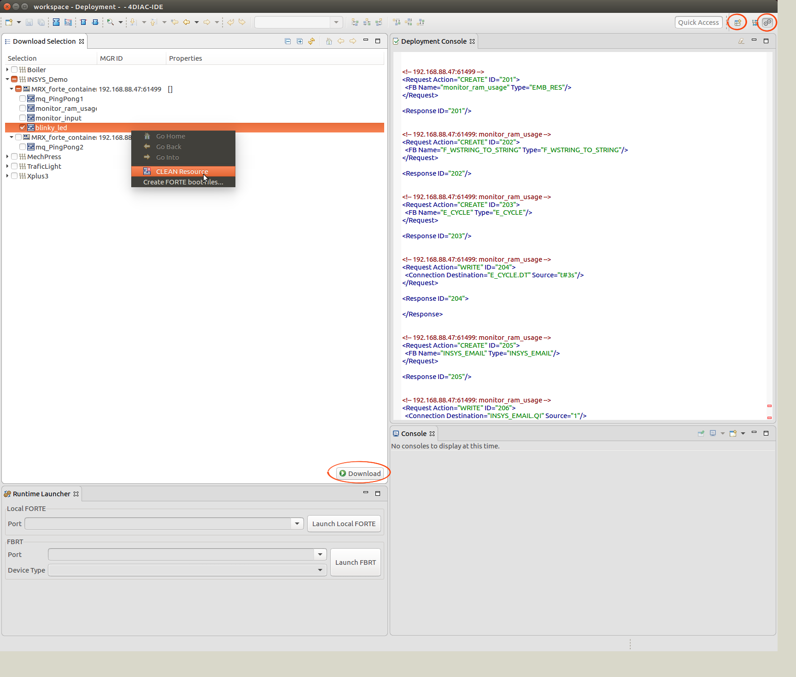
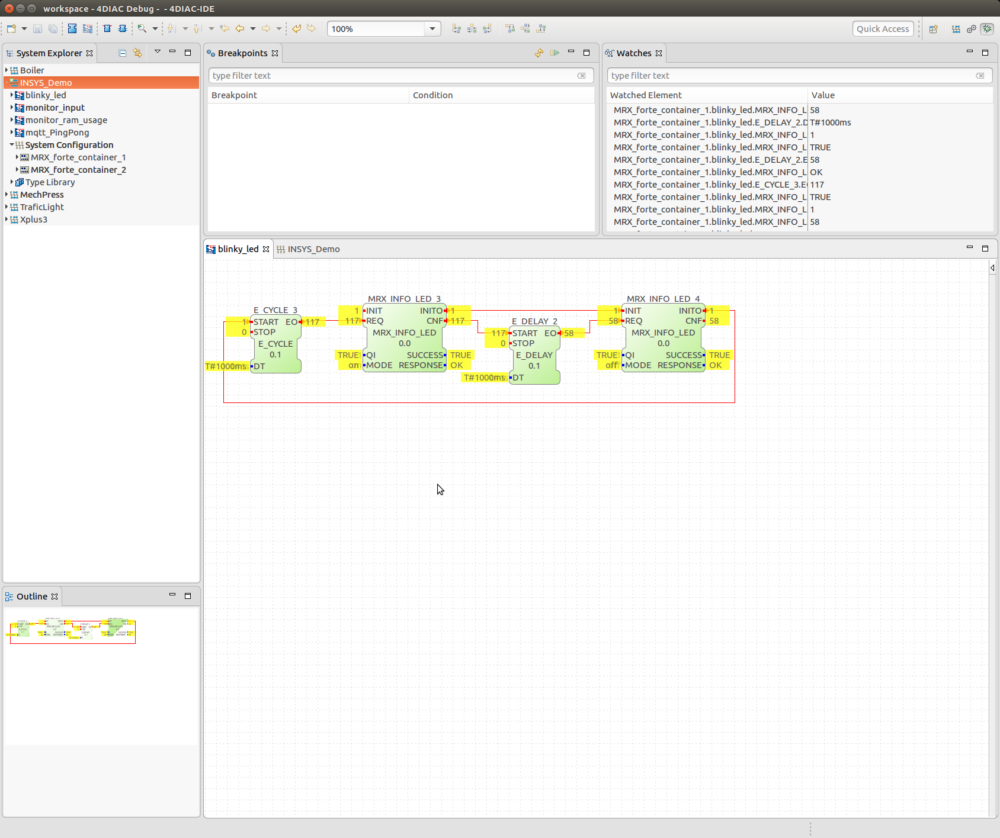

# Container Application "Eclipse 4DIAC"

## Introduction
(4DIAC)[https://eclipse.org/4diac/] is an open source Soft-PLC project hosted under the Eclipse foundation, developed and maintained by the (fortiss)[https://www.fortiss.org/en/research/projects/4diac/] research institute of TU Munich.
The 4DIAC IDE and the FORTE runtime environment, provide a framework for distributed industrial automation and control by implementing the IEC 61499 standard.
The framework is used to implement distributed/interacting control tasks spread among different target devices turning the target devices into Soft-PLCs participating in the overall control application.

This document describes how to set up the 4DIAC-IDE on your development machine and connect to a container with the forte-RTE on your target router.

## Download and prepare the 4diac-IDE
Download and unpack the latest stable release of the 4diac-IDE from [here](http://www.eclipse.org/4diac/en_dow.php). If you want to install from source, download directly from the [4diac-repositories](http://git.eclipse.org/c/4diac/org.eclipse.4diac.ide.git).

### Check 4diac-IDE execution
Change into the 4diac-folder and run the 4diac executable. Set the workspace to suggested folder and check if the 4diac-IDE starts without errors.

### Download demo projects
In order to access router functionalities like I/Os, sending Emails and MQTT messages, reading CPU and RAM usage through the command-line interface - router specific interface function blocks need to be added. Some sample applications are provided to demonstrate working with the router specific function blocks.

(Download)[] the demo projects archive and save locally. Within the 4diac-IDE select File>Open projects. The following window appears: 

Select the archive with demo projects and import the eclipse project and click finish.

The INSYS_Demo project should appear within the *System Explorer*: 

Before you can start playing with the demo projects and create your own distributed applications, at least one device with the forte runtime-environment is necessary which we will install in the next step.

## Install and configure a container with 4diac-RTE (forte)
In order to execute your modelled control applications across various devices, on every involved device a runtime needs to be present. The 4diac runtime environment (RTE) is called forte and a prebuilt container for INSYS routers is available for download (here)[http://m3-container.net/M3_Container/images/container_forte.tar].
Upload and configure the forte container on your router (Administration>Container>Import container). Bridge the container to an IP net that has access to the internet. Enter the container and set up the networking there. Enter a reachable address for the DNS server, most likely this will be the routers IP address:
<pre>
root@container_forte ~  $ <b>echo "nameserver \<IP address of nameserver\>" > /etc/resolv.conf</b>
</pre>

Edit the script that will set the default gateway after starting the container:
<pre>
root@container_forte ~  $ <b>vi /bin/start_net</b>
</pre>
Press \<i\> to enter the editing mode of vi and exchange the IP address of the default gateway, most likely this will also be the routers IP address. Store and exit vi with the keys \<ESC\>\<:\>\<x\>.

Execute the script, so the default route gets set:
<pre>
root@container_forte ~  $ <b>/bin/start_net</b>
</pre>

Test the network connection and make sure that tcp traffic is allowed to your container through the IP-filter.

## Run demo application *blinky_led*
To verify the correct installation of 4diac and the forte container on your INSYS router, we will deploy the *blinky_led* demo application.
The application will toggle your routers Info-LED with the specified interval when running.</b>

</b>

First go to *System Configuration* tab in the *System Explorer* and configure your local resource. 
You might have only one forte container on your router currently, which is sufficient if you only want to work with a single device in the beginning. For more sophisticated projects you can instantiate multiple forte containers on your router to simulate a distributed system.

Change the IP address of the *Container_1* to your containers IP address by editing the *Virtual DNS* environment variables. 

On the device multiple so called *embedded resources* are present. It allows you to deploy multiple applications to a single device and run them in parallel. For the *blinky_led* application we only use the embedded resource *blinky_led* for now. 

 

After configuring the application, switch to the deployment console. If the console is not visible by default, click on the symbol in the upper right corner *Open Perspective*.

 

In the *Download Selection* clean the *blinky_led* resource first to remove all programs that might be on the embedded resource.
Afterwards Download the blinky application to the embedded resource on your forte device. The download is successful if no errors are shown in the *Deployment Console*.

 

Check the Info-LED on your router, it should now blink with the specified interval in the application.

## Monitor application execution
4diac gives you the opportunity to see the execution of your application live within the IDE.
Therefore go back to the *System* perspective.
Right click on INSYS_Demo system and select "Monitor System". A small green circle appears next to the system.
Afterwards right click into every Function-Block of the blinky application and select "Watch All". Next to the Function Blocks the current values shall be shown.

Important: Before downloading or cleaning the embedded resource, exit the system monitoring first otherwise communication with the container will fail!
 

 

 
